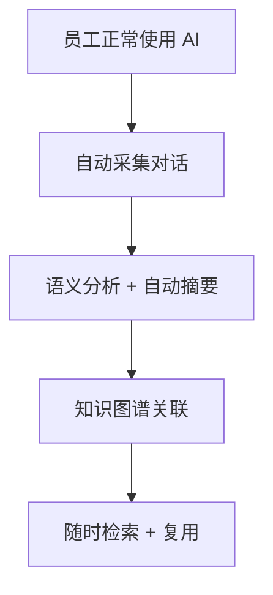

# 微信公众号文章

---

## 标题

**CTO 最怕的事：核心员工带走了几千条 AI 推演记录**

---

## 封面建议

深色背景 + 文字："80% 的 AI 对话，随着离职永久消失" + 一条被撕掉的聊天记录视觉元素

---

## 正文

### 1. 一个真实的故事

> "王哥，之前微服务拆分的方案是怎么讨论出来的？"
>
> "交接文档我看了，但只有最终架构图。我想看看推演过程——为什么选了方案 A 而不是 B，中间踩了什么坑。"
>
> 沉默。
>
> 因为王哥三个月前就离职了。

如果你管理着一个技术团队，这个故事你一定不陌生。

核心员工离职，带走的不只是人——还有他和 AI 花了几十个小时碰撞出来的完整认知链。

文档写了。但文档只记录了结论。水面下那 90% 的推演过程、试错、对比、取舍——全在 ChatGPT/Claude 的聊天记录里。人走了，记录跟着没了。

**这就是 AI 时代的"知识断层"。**

而且，这不只是程序员的问题。

---

### 不只是开发团队

如果你觉得这只是技术团队的痛点，看看这些场景：

**产品团队**：资深 PM 离职，PRD 还在。但"为什么砍掉用户呼声最高的那个功能""为什么先做 B 端后做 C 端"——两周的 AI 对话推演里藏着所有决策逻辑。比一份 PRD 值钱一百倍。

**设计团队**：设计负责人走了，Figma 文件完好。但"为什么组件用 8px 圆角而不是 12px""为什么暗色模式选深灰而不是纯黑"——几百轮 AI 对话背后的设计哲学，从此消失。

**运营团队**：去年双十一的爆款活动，复盘 PPT 完好。但"为什么第一波选小红书而不是抖音""为什么文案策略从痛点切入"——策略思考的全过程，在运营总监和 ChatGPT 的对话里，已经跟着账号注销了。

**法务团队**：法务总监和 AI 逐条推演了一份跨国合同的 GDPR 条款。接收/拒绝的逻辑链，每一条都有完整论证。她休假了，接手的同事只能看到合同终稿。

**任何深度使用 AI 的角色——产品、设计、运营、法务、HR、销售——都在重复同一个悲剧：结论留下了，思考消失了。**

---

### 2. 你不是没做知识管理，你是用旧工具管新问题

我们团队做了一次统计：

```
50 个工程师
× 每天 5 次深度 AI 对话（架构、排障、方案对比，不是"帮我写个SQL"）
× 250 个工作日
= 年产出约 66,000 条认知碎片
```

然后我们问了三个问题：

**问题 1：这些碎片里有多少能被其他人检索到？**

答案：几乎为零。每个人和 AI 的对话锁在自己的账号里。

**问题 2：有人离职后，他的 AI 对话去哪了？**

答案：消失了。和这个人的公司账号一起被注销。

**问题 3：新人遇到同样的技术问题，能不能看到前辈和 AI 推演过的讨论？**

答案：不能。只能靠口口相传。或者再花 3 天从零和 AI 聊一遍。

**每年 66,000 条认知碎片，80% 随着人员流动永久丢失。**

这不是管理不善。这是工具不对。

---

### 3. 旧工具的三个致命缺陷

传统知识管理（Wiki / Confluence / 共享文档）在 AI 时代全面失效。

**缺陷 1：靠人写，不是自动记录**

写文档的收益归组织，成本归个人。一个工程师花了 3 天和 Claude 讨论出一个方案，他会再花 3 小时写成文档吗？大概率不会。他会写个结论贴到 Jira 上，然后说"就这样吧"。

**缺陷 2：只存结论，不存过程**

文档天然只能承载最终结果。但组织学习的核心不是"知道什么"，而是"怎么知道的"。那些被否定的方案、踩过的坑、对比维度的变更——才是后来者最需要的东西。

**缺陷 3：搜索等于关键词匹配**

你的新人在 Wiki 里搜"为什么订单服务响应慢"，出来的文档是"订单系统操作手册 v2.3"——不是三个月前运维和 ChatGPT 讨论的那场"凌晨三点数据库连接池耗尽故障排查"。

**核心矛盾：知识管理的成本在个人，收益在组织。所以没人有动力做。**

---

### 4. 解决思路：把成本从人转移到系统

答案是：**让知识管理自动化。**



**这个链条的起点，是员工的日常行为本身。不需要任何额外操作。**

就像 Git 记录代码变更一样——程序员不需要"手动提交到知识库"，git push 本身就是知识沉淀。AI 对话也应该如此：正常使用 AI，对话自动归档。

---

### 5. 我们做了什么

基于这个思路，我们做了一套系统：**AI Memory Hub**。

概括起来就四件事：

**自动采集**：浏览器扩展静默运行。员工在 ChatGPT、Claude、DeepSeek、Kimi、Gemini 上正常聊天，对话实时同步到公司的知识中枢。零手动。

**智能理解**：每条对话自动生成标题、标签、摘要。向量 embedding 做语义索引。不需要人整理，系统自动结构化。

**图谱关联**：自动发现对话之间的关联。不只是研发——产品聊需求、设计聊交互、运营聊策略、法务聊合规——同一个业务的知识自动跨角色缝合。

**随时复用**：网页搜索 + 侧边栏随手查。输入自然语言，找到所有相关历史讨论。一键复制上下文，注入任意 AI 平台，让 AI 基于团队知识积累来回答。

**最重要的是：数据 100% 在你自己的服务器上。** 不注册、不联网、不上传。

开源，自己部署：

```bash
git clone <repo>
cd AIHub
./start.sh    # 后端 + 前端，一键启动
```

---

### 6. 为什么是现在？

三个趋势正在汇聚：

**趋势 1：AI 使用量爆发。** 2025-2026 年，深度使用 AI 的工程师比例从"少数"变为"多数"。AI 对话正在成为日均产出最高的知识形态。

**趋势 2：人才流动性加剧。** 技术人才的流动性不会逆转。依赖"人记住"而非"系统记录"的知识管理，会越来越脆弱。

**趋势 3：企业合规需求浮现。** 越来越多公司在问："员工把什么贴给了 ChatGPT？我们怎么管？"这不是杞人忧天——去年已经有多起因为员工用 AI 导致数据泄露的事件。

**AI 对话管理不是"加分项"，而是下一个 Git。**

就像 15 年前，代码管理从 SVN 到 Git 是一次范式转移——从"集中式、靠人遵守"到"分布式、系统自动"。

AI 对话管理现在就在 Git 出现之前的状态：每个人都用自己的方式存着，公司完全失控。

---

### 7. 一个实验

如果你正在管理一个超过 20 人的团队（不限技术），可以做个简单实验：

1. 找一个最近离职的核心员工的名字
2. 在你们所有的文档系统里搜索他的产出
3. 看看能找到多少他"和 AI 的完整讨论过程"
4. 然后问问自己：新人接手他的工作，真的够吗？

无论是开发、产品、设计、运营还是法务——大概率你会发现：结论都在，过程全无。

这就是 AI Memory Hub 要解决的问题。

---

### 8. 结尾

> 每一个员工和 AI 的对话，都不是一次性的消耗品。它是企业的知识资产。
>
> 把它留下。沉淀。复用。

项目开源在 GitHub：**[链接]**

技术架构和详细设计 → 仓库 `TECHNICAL.md`

欢迎 Star、提 Issue、参与贡献。

---

## 发布 Checklist

- [ ] 封面图（深色背景 + 核心数据 + 视觉冲击）
- [ ] 正文排版（秀米/135编辑器，简洁风格）
- [ ] Mermaid 架构图转成静态图片（公众号不支持 Mermaid）
- [ ] 文末"阅读原文"跳转 GitHub
- [ ] 评论区引导语预埋（引导团队管理者留言求助）
- [ ] 个人微信/读者群入口（文末"加我微信，讨论团队 AI 知识管理"）

---

## 传播设计

**转发话术（一键复制版）：**

> CTO 最怕的事——核心员工离职，几千条 AI 对话跟着消失。我们做了个开源系统解决这个问题。数据自托管，不改变任何工作习惯。推荐给正在带团队的你。

**群发话术：**

> 分享一篇关于"AI 时代的知识管理"的思考。核心观点：传统的 Wiki/Confluence 管不了 AI 对话，因为知识管理的成本在个人、收益在组织，没人有动力写。解决方案是让系统自动采集。我们把它做成了开源工具，感兴趣的可以看看。
